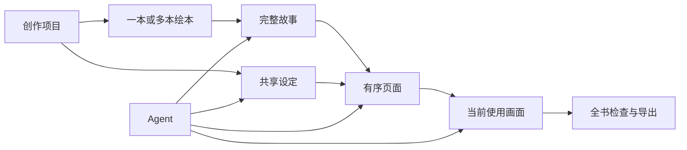

# 绘本创作 — 从共享设定到多本绘本

> Lumi 是通过 Agent 协作持续创作一本或多本绘本的本地优先工具。



## 1. 产品定位

Lumi 是面向绘本创作者的本地优先 AI 创作工具，帮助用户通过 Agent 协作，把一个创作方向持续沉淀为共享设定和一本或多本绘本；每本绘本继续沉淀为完整故事、有序页面和可交付画面。项目工作区围绕“查看项目、维护设定、选择绘本”组织，不要求用户理解创作流程的内部层级。

Lumi 不是通用 AI 画布，也不是漫画连载平台。它围绕“一个创作项目持续完成多本绘本”的生产过程组织产品。

## 2. 目标用户

| 用户 | 主要场景 | 核心困难 |
|---|---|---|
| 独立绘本创作者 | 从灵感开始创作一本完整绘本 | 故事、视觉设定和逐页画面难以保持一致。 |
| 亲子内容创作者 | 快速制作可阅读、可分享的儿童故事 | 会表达故事想法，但不熟悉分页与视觉生产。 |
| 小型内容团队 | 共同打磨故事并生成页面画面 | AI 结果容易散落在聊天和文件中，难以形成稳定产物。 |

首期优先服务单人创作。多人实时协作不是首期前置条件。

## 3. 核心价值

1. 用户可以像与创作伙伴交谈一样开始，不需要先理解复杂工具结构。
2. Agent 产生的有效结果会进入创作项目或具体绘本，形成可以继续编辑、复用和追溯的正式产物。
3. 产品用绘本自身的创作结构组织内容，让用户能从完整故事稳定推进到逐页画面。

## 4. 产品对象

```text
Lumi
├── 首页 Agent
│   ├── 默认不关联项目的对话
│   ├── 可选关联一个已有项目
│   └── 可选关联一本已有绘本
└── 创作项目
    ├── 项目主页
    │   ├── 项目概览：代表图、名称、创作方向
    │   ├── 设定入口
    │   └── 绘本列表
    ├── 共享设定
    │   ├── 角色
    │   ├── 场景
    │   └── 道具
    └── 绘本（一本或多本）
        ├── 基本信息与故事简介
        ├── 完整故事
        └── 页面与画面
            ├── 封面（可选）
            ├── 正文页（有序）
            └── 封底（可选）
```

## 5. 产品原则

### 5.1 Agent 优先，产物优先于聊天

首页允许用户直接发起对话。对话负责理解意图、追问、执行和解释结果；完整故事、设定与页面负责保存最终采用的内容。用户不应为了找回正式产物而翻聊天记录。

### 5.2 项目包含一本或多本绘本

项目是围绕一个 IP、主题或长期创作方向建立的空间，可以只包含一本绘本，也可以包含多本绘本。绘本是可独立完成的作品，也是故事、页面和画面的直接容器。“第 1 册”只作为绘本的可选排序信息，不增加系列、卷或章节实体。

### 5.3 生产工具，不承担发布平台职责

Lumi 负责把内容生产到可预览、可导出的状态。导出属于创作交付，不等于出版或发布。

### 5.4 结构服务于绘本，不抽象为通用画布

页面顺序、设定引用和生成过程可以被系统化，但不提供自由摆放节点、连线、缩略地图或通用工作流编排。

### 5.5 用户始终知道 Agent 在操作什么

未关联、关联项目、关联某本绘本、进入某本绘本工作区是四种不同上下文，界面必须明确展示当前状态，不能隐式切换或写入错误项目或绘本。

### 5.6 工作区优先给内容和 Agent

用户进入项目后，全局左侧栏自动收起，把宽度让给项目内容与 Agent。项目主页不常驻“概览、故事、页面”三级标签，只展示项目概览、共享设定入口和绘本列表。进入具体绘本后，才展示该绘本的故事与画面工作区。

### 5.7 `@` 是上下文引用，不是立即执行

用户在设定或页面上点击 `@` 后，系统把对应对象作为结构化引用加入 Agent 输入框并聚焦输入框，不自动发送、不自动生成。用户仍需补充意图并主动发送。

## 6. 功能范围

### P0

- Agent 首页与默认未关联项目的对话。
- 创建、打开和切换创作项目。
- 在项目内创建、打开、切换和排序绘本。
- 项目主页、共享设定和绘本列表。
- 绘本故事简介与完整故事。
- 平铺维护角色、场景、道具设定，并可 `@` 引用到 Agent。
- 完整故事编辑、版本与分页。
- 有序页面编辑、页面文字、画面说明、设定引用和画稿版本。
- 基于当前页面内容直接生成新稿，或 `@` 页面后与 Agent 协作生成。
- 逐页编辑、全书视图、可选封面/封底、全屏阅读与基础导出。
- 模型配置、LLM 调用状态、语言偏好与错误恢复。

### P1

- 多套分页方案的比较与切换。
- 页面拆分、合并、批量重排与跨页版式关系。
- 更完整的故事与页面差异同步。
- 项目内结构化内容搜索。

### 非目标

- 无限画布、节点连线和通用工作流编辑器。
- 独立的系列、连载、卷和章节实体；绘本仅保留可选册序。
- 出版社、书号、印次、发行渠道、上架和读者发布。
- 社区内容消费、推荐流和读者互动。
- 首期多人实时协作。

## 7. 成功标准

| ID | 标准 |
|---|---|
| S-01 | 新用户无需先创建项目，即可在首页发起第一次有效创作对话。 |
| S-02 | 用户能从侧栏一步进入已有项目，在项目主页看清全部绘本，并在进入项目后自动收起全局侧栏。 |
| S-03 | 用户能明确区分故事简介、完整故事与分页页面。 |
| S-04 | 用户能从完整故事生成结构化页面，并逐页修改而不破坏原故事版本。 |
| S-05 | 用户能在项目中找到共享设定，并在具体绘本中找到已采用的故事和页面，不依赖聊天历史。 |
| S-06 | 用户能在设定或页面上点击一次 `@`，把正确对象加入当前上下文的 Agent 输入框。 |
| S-07 | 用户修改页面内容后，可以直接生成新画稿；已有当前使用画面不会被清空或替换。 |
| S-08 | 用户能从项目主页在 2 次点击内创建一本绘本，且创建失败不会丢失名称或创作想法。 |

## 8. 文档信息

| 项目 | 内容 |
|---|---|
| 版本 | v0.3 |
| 状态 | 草稿 |
| 日期 | 2026-08-24 |
| 平台 | Web / Desktop |
| 来源 | 产品讨论与竞品调研结论 |
| 数据模型 | [`data_model.md`](data_model.md) |
| 核心 Feature | [`features/项目与绘本工作区.md`](features/项目与绘本工作区.md) |

## 9. 版本记录

| 版本 | 日期 | 变更 |
|---|---|---|
| v0.1 | 2026-08-20 | 明确 Lumi 聚焦绘本创作，确定 Agent 首页、项目结构及非目标。 |
| v0.2 | 2026-08-24 | 项目工作区收敛为项目主页、设定与画面；新增 `@` 引用、页面直接生成和侧栏自动收起原则。 |
| v0.3 | 2026-08-24 | 项目改为可包含多本绘本；共享设定归属项目，故事、页面和画稿归属绘本；册序不新增结构层级。 |
